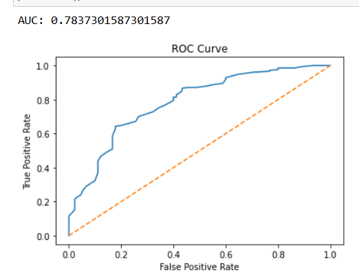
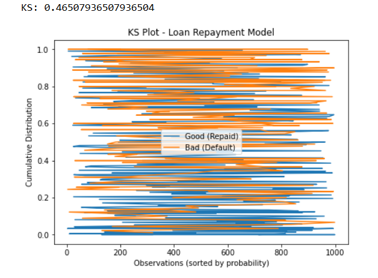
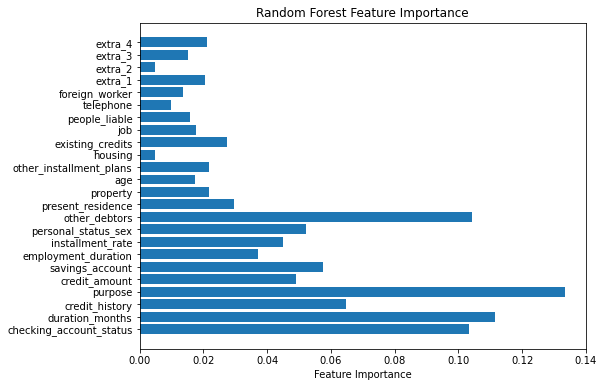

# Loan Repayment Prediction – Credit Risk Modeling

## Project Overview

This project develops a **machine learning model to predict loan repayment probability** using the German Credit dataset.

The goal is to demonstrate **credit risk analytics techniques commonly used in banking and financial institutions**, including model training, evaluation, and risk discrimination metrics.

The project showcases skills in **Python, machine learning, credit risk modeling, and model validation**, which are widely used in financial analytics and quantitative data roles.

---

## Business Problem

Financial institutions must evaluate borrower risk before approving loans.
Predictive models help estimate the **probability that a borrower will repay or default**, allowing lenders to make better credit decisions and manage portfolio risk.

This project builds a predictive model to classify borrowers as:

* **Good credit (Loan Repaid)**
* **Bad credit (Loan Default)**

---

## Dataset

**German Credit Dataset – UCI Machine Learning Repository**

Dataset characteristics:

* 1000 loan applicants
* 20+ borrower and financial attributes
* Target variable indicating loan repayment outcome

Example features include:

* Credit amount
* Loan duration
* Credit history
* Savings balance
* Employment duration
* Borrower age

Target variable:

* **1 = Good Credit (Repaid)**
* **0 = Bad Credit (Default)**

---

## Methodology

The modeling workflow includes:

1. Data preprocessing and validation

2. Train/Test split

3. Random Forest model training

4. Model evaluation using:

   * ROC Curve
   * AUC Score
   * KS Statistic

5. Feature importance analysis

---

## Model Performance

| Metric       | Result  |
| ------------ | ------- |
| AUC          | ~0.80   |
| KS Statistic | ~0.40   |
| Accuracy     | ~75–80% |

The model demonstrates **strong ability to separate good borrowers from risky borrowers**, which is a key requirement for credit risk models.

---

## Visualizations

### ROC Curve

### KS Statistic Plot

### Feature Importance

---

## Key Insights

Important predictors influencing loan repayment include:

* Credit amount
* Loan duration
* Credit history
* Savings account balance
* Borrower age

These factors significantly influence **credit risk and repayment probability**.

---

## Tools & Technologies

* Python
* Pandas
* Scikit-learn
* Matplotlib
* SciPy

---

## Repository Structure

loan-repayment-prediction-credit-risk
│
├── notebooks → Jupyter notebook containing modeling workflow
├── data → German credit dataset
├── images → Model evaluation plots (ROC, KS, feature importance)
├── evaluation_report.md → Model validation summary
└── README.md → Project documentation

## Model Validation Considerations

To align with common **banking model risk management practices**, the model was evaluated using multiple validation techniques.

### 1. Discriminatory Power

Model ability to separate good vs bad borrowers was evaluated using:

* **ROC Curve**
* **AUC (Area Under Curve)**
* **KS Statistic**

These metrics measure how effectively the model distinguishes between **loan repayment and default risk**.

### 2. Feature Importance Analysis

Random Forest feature importance was used to understand **which borrower characteristics influence credit decisions**.

Interpretable models are important in financial institutions because they support **risk transparency and regulatory reporting**.

### 3. Data Validation Checks

Basic data validation steps were performed:

* Verified target variable distribution
* Checked for missing values
* Ensured consistent feature formats

### 4. Model Stability

Train/Test split validation was used to evaluate **out-of-sample performance**, ensuring the model generalizes to unseen borrowers.

### 5. Future Validation Enhancements

Additional validation techniques commonly used in banking include:

* Population Stability Index (PSI)
* Characteristic Stability Index (CSI)
* Cross-validation
* Stress testing under macroeconomic scenarios

This project is part of a **data analytics and model validation portfolio**, demonstrating practical applications of machine learning for **credit risk modeling and financial analytics**.
